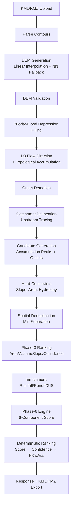

# AI Pond Recommendation API

**Contour-map based terrain analysis and pond planning API**

---

## Overview

The AI Pond Recommendation API analyzes uploaded KML/KMZ contour maps to recommend optimal pond locations. It processes contour lines through a multi-phase pipeline: DEM generation → hydrological analysis → catchment delineation → candidate generation → suitability scoring → geographic enrichment → final ranking.

---

## Problem Statement

Traditional pond site selection relies on manual surveying and heuristic rules. This API automates the process by:

- Converting contour lines into a Digital Elevation Model (DEM)
- Computing hydrological flow networks (D8 algorithm)
- Identifying natural water accumulation zones
- Scoring sites by terrain, hydrology, geography, rainfall, and storage potential
- Enriching with real-world GIS data (OSM roads, buildings, water bodies)

---

## Objectives

- Automate pond site identification from contour maps
- Provide explainable, evidence-based suitability scores
- Integrate real-world GIS data (OpenStreetMap) for feasibility
- Estimate rainfall-runoff and indicative storage potential
- Maintain deterministic, reproducible results

---

## Key Features

| Feature | Status | Description |
|---------|--------|-------------|
| KML/KMZ contour parsing | ✅ Implemented | Extracts elevation contours from KML/KMZ |
| DEM generation | ✅ Implemented | Linear interpolation + nearest-neighbor fallback |
| D8 hydrology | ✅ Implemented | Priority-flood depression filling + topological accumulation |
| Catchment delineation | ✅ Implemented | Upstream tracing with area validation |
| Candidate generation | ✅ Implemented | Flow accumulation peaks + outlet detection |
| Hard constraints | ✅ Implemented | Slope, area, hydrology validity |
| Deduplication | ✅ Implemented | Spatial hashing with minimum separation |
| Phase-3 ranking | ✅ Implemented | Heuristic scoring (area, accumulation, slope, etc.) |
| Phase-4 geographic context | ✅ Implemented | OSM Overpass API (roads, buildings, water) |
| Phase-5 rainfall/runoff | ✅ Implemented | Open-Meteo historical + rational method |
| Phase-6 recommendation engine | ✅ Implemented | 6-component scoring + confidence + explanations |
| API endpoints | ✅ Implemented | FastAPI with structured responses |
| Frontend | ✅ Implemented | Leaflet map + file upload + results dashboard |
| KML/KMZ export | ✅ Implemented | Export analysis results |

---

## System Architecture



---

## End-to-End Workflow

1. **Upload**: User uploads KML/KMZ contour file via `/analyzeContour`
2. **Parse**: Extract contour lines with elevations → `ContourData`
3. **DEM**: Linear interpolation (LinearNDInterpolator) + nearest-neighbor fallback → `DEM`
4. **Validate**: Elevation stats, slope stats, contour consistency → `DEMValidationResult`
5. **Hydrology**: 
   - Priority-flood depression filling (epsilon)
   - D8 steepest-descent flow direction
   - Topological flow accumulation (Kahn's algorithm)
   - Outlet detection (boundary outlets + internal endpoints)
5. **Catchment**: Upstream tracing from primary outlet → `catchment_mask`, area
6. **Candidates**: 
   - Seeds = flow accumulation local maxima + outlets
   - Features: elevation, slope, accumulation, drainage area, outlet info
   - Hard constraints: slope ≤ 35°, area ≥ min, valid hydrology, resolved outlet
   - Deduplication: spatial hashing with min separation
   - Ranking: weighted heuristic (area 35%, accumulation 25%, slope 20%, etc.)
7. **Enrichment (optional)**:
   - OpenTopography DEM
   - Rainfall (Open-Meteo) → seasonal → runoff (V = P × A × C)
   - OSM Overpass: water bodies, roads, buildings → distances, feasibility
   - Place search + geocoding
8. **Phase-6 Engine**:
   - 6-component scoring: hydrology, terrain, geography, rainfall, runoff, storage
   - Confidence calculation (data quality based)
   - Explanation generation (strengths/concerns/missing)
   - Deterministic ranking: score → confidence → flow accumulation → coordinates
8. **Response**: Full JSON + optional KML/KMZ export

---

## Technology Stack

| Category | Technology |
|----------|------------|
| API Framework | FastAPI 0.116, Uvicorn |
| Numerical | NumPy 2.2, SciPy 1.15 |
| Geospatial | Shapely 2.1, PyProj 3.7, GeoPandas 1.1 |
| Interpolation | SciPy LinearNDInterpolator (Qhull) |
| Spatial Index | SciPy KDTree, Shapely STRtree |
| KML/KMZ | lxml 6.0, zipfile |
| HTTP | httpx 0.28 (async), requests |
| Geocoding | Nominatim (OpenStreetMap) |
| Rainfall | Open-Meteo Historical Archive API |
| DEM Source | OpenTopography SRTMGL1 |
| GIS Data | OSM Overpass API |
| Frontend | Leaflet 1.9.4, vanilla JS |
| Testing | pytest 8.4, pytest-asyncio |

---

## Project Structure

```
AI pond recommendation/
├── backend/                    # Core backend package
│   ├── main.py                 # FastAPI app + all endpoints
│   ├── parser.py               # KML/KMZ parsing → ContourData
│   ├── terrain.py              # DEM generation, slope calculation
│   ├── hydrology.py            # D8, accumulation, outlets, depression filling
│   ├── catchment.py            # Catchment delineation, area, GeoJSON
│   ├── candidates.py           # Phase-3 candidate generation & ranking
│   ├── suitability.py          # Phase-3/4/5/6 component scoring
│   ├── suitability.py          # Phase-3/4/5/6 component scoring
│   ├── recommendation_engine.py # Phase-6 unified ranking engine
│   ├── geographic_context.py   # OSM Overpass enrichment
│   ├── rainfall_runoff.py      # Open-Meteo + rational method
│   ├── dem_validation.py       # DEM quality metrics
│   ├── depression.py           # Priority-flood depression filling
│   ├── catchment.py            # Catchment delineation & validation
│   ├── candidates.py           # Candidate generation & ranking
│   ├── recommendation_engine.py# Phase-6 unified ranking engine
│   ├── geographic_context.py   # OSM Overpass enrichment
│   ├── rainfall_runoff.py      # Open-Meteo + rational method
│   ├── dem_validation.py       # DEM quality metrics
│   ├── depression.py           # Priority-flood depression filling
│   ├── models.py               # Pydantic/dataclass models
│   ├── parser.py               # KML/KMZ parsing
│   ├── recommendation.py       # Legacy ranking (compat)
│   ├── terrain.py              # DEM + slope
│   ├── instrumentation.py      # Stage timing, tracing
│   ├── data_quality.py         # Metrics aggregation
│   ├── models.py               # Pydantic/dataclass models
│   ├── parser.py               # KML/KMZ parsing
│   ├── recommendation.py       # Legacy ranking (compat)
│   ├── terrain.py              # DEM + slope
│   ├── services/               # External API clients
│   │   ├── cache.py            # File-based cache (SHA-256 + TTL)
│   │   ├── land_service.py     # OSM Overpass land context
│   │   ├── opentopography_service.py
│   │   ├── rainfall_service.py # Open-Meteo Archive API
│   │   ├── geocoding_service.py
│   │   ├── place_search_service.py
│   │   ├── location_service.py
│   │   ├── kml_export_service.py
│   │   └── api_client.py
│   └── __init__.py
├── frontend/                   # Static frontend
│   ├── index.html              # Leaflet map + upload form
│   ├── app.js                  # Map, upload, results rendering
│   └── style.css
├── tests/                      # 330+ tests
│   ├── test_*.py               # Unit + integration tests
│   ├── conftest.py             # Fixtures
│   └── fixtures.py             # Test data generators
├── docs/                       # Documentation
│   ├── api-inventory.md
│   ├── architecture-current.md
│   ├── known-issues.md
│   ├── phase*-results.md
│   └── *.md
├── benchmarks/                 # Performance benchmarks
├── sample_contours.kml         # Sample input
├── config.py                   # Centralized Settings (Pydantic)
├── pyproject.toml              # Build config + deps
├── requirements.txt
├── pytest.ini
├── config.py                   # Centralized Settings (Pydantic)
├── logging_config.py
├── logging_config.py
└── explainability.py           # Legacy explainability shim
```

---

## Installation & Setup

```bash
# Clone
git clone <repo-url>
cd "AI pond recommendation"

# Create venv
python -m venv .venv
source .venv/bin/activate

# Install
pip install -r requirements.txt

# Or with dev deps
pip install -e ".[dev]"
```

### Environment Variables

Create `.env` from `.env.example`:

```bash
# Required
OPENTOPOGRAPHY_API_KEY=your_key_here

# Overpass (optional - has defaults)
OVERPASS_URL=https://overpass-api.de/api/interpreter
OVERPASS_FALLBACK_URL=https://overpass.kumi.systems/api/interpreter
OVERPASS_TIMEOUT_SECONDS=25.0
OVERPASS_RETRIES=2

# Overpass (Phase 4)
POND_GEO_CLUSTER_RADIUS_M=1000
POND_GEO_BBOX_BUFFER_M=1000
POND_GEO_MAX_CONCURRENCY=4
POND_GEO_PROVIDER_TIMEOUT_S=20
POND_GEO_PROVIDER_RETRIES=2
POND_GEO_CACHE_TTL_S=86400
POND_GEO_NEARBY_RADIUS_M=500

# Recommendation Engine
POND_MAX_SLOPE_DEGREES=35
POND_MIN_CATCHMENT_AREA_M2=0
POND_MIN_RAINFALL_MM=0
POND_MIN_WATER_DISTANCE_M=25
POND_MIN_ROAD_DISTANCE_M=25
POND_MIN_BUILDING_DISTANCE_M=25
POND_REJECT_INSIDE_WATER=true

# Rainfall/Runoff
POND_RUNOFF_COEFFICIENT=0.3
POND_SEASONAL_MONTHS=6,7,8,9
POND_RAINFALL_YEARS=5
POND_RAINFALL_CACHE_TTL_S=2592000
```

---

## Running the Server

```bash
# Development
uvicorn backend.main:app --reload --host 0.0.0.0 --port 8000

# Production
uvicorn backend.main:app --host 0.0.0.0 --port 8000 --workers 4

# With instrumentation
POND_INSTRUMENTATION=1 uvicorn backend.main:app --reload
```

### Frontend

Serve `frontend/` with any static server:
```bash
cd frontend && python -m http.server 5500
# Then open http://localhost:5500
```

---

## API Documentation

### Endpoints

| Method | Path | Description |
|--------|------|-------------|
| `GET` | `/` | Service info + route index |
| `GET` | `/health` | Health check |
| `POST` | `/analyzeContour` | Full contour analysis (KML/KMZ) |
| `POST` | `/analyzeLocation` | Location-based analysis (lat/lon/radius) |
| `POST` | `/analyze` | Legacy unified analysis (deprecated) |
| `POST` | `/recommendPond` | Legacy ranking (deprecated) |
| `POST` | `/analyzeContour/enriched` | **Deprecated** - use `/analyzeContour` with `enriched=true` |
| `POST` | `/exportLocationKml` | Export analysis as KML |
| `POST` | `/exportLocationKmz` | Export analysis as KMZ |
| `POST` | `/gis/land-context` | OSM features for bbox (GIS overlay) |

### Request/Response Examples

#### `POST /analyzeContour`

**Request**: `multipart/form-data` with `file` (KML/KMZ)

**Query**: `enriched=true` (default) or `enriched=false`

**Response** (truncated):
```json
{
  "status": "success",
  "input": {
    "filename": "site.kml",
    "contours_detected": 12,
    "elevation_min_m": 100.0,
    "elevation_max_m": 200.0,
    "coordinate_system": "EPSG:32644"
  },
  "contour_diagnostics": { ... },
  "terrain": {
    "grid_rows": 200,
    "grid_columns": 180,
    "min_elevation_m": 100.0,
    "max_elevation_m": 200.0,
    "mean_elevation_m": 150.0,
    "mean_slope_degrees": 4.2,
    "max_slope_degrees": 18.5,
    "valid_cell_fraction": 0.95
  },
  "dem_validation": {
    "status": "good",
    "score": 0.92,
    "warnings": []
  },
  "hydrology": {
    "flow_direction_shape": [200, 180],
    "max_flow_accumulation_cells": 50000.0,
    "mean_flow_accumulation_cells": 50.0,
    "sink_cells": 12,
    "edge_outflow_cells": 8,
    "valid_cells": 35000,
    "cell_area_m2": 25.0,
    "valid_flow_direction_fraction": 0.98,
    "cycle_cells": 0,
    "outlet": { ... },
    "validation": { ... }
  },
  "catchment": {
    "area_m2": 150000.0,
    "area_hectares": 15.0,
    "area_km2": 0.15,
    "cell_count": 6000,
    "boundary": { "type": "Polygon", "coordinates": [...] },
    "validation": { ... },
    "geometry": { ... }
  },
  "rainfall_runoff": {
    "rainfall_mm": 1150.0,
    "mean_annual_seasonal_rainfall_mm": 230.0,
    "catchment_area_m2": 150000.0,
    "runoff_coefficient": 0.3,
    "estimated_runoff_m3": 10350.0,
    "estimated_storage_m3": 5175.0,
    "water_availability_status": "good",
    "data_quality": { ... }
  },
  "land_features": {
    "water_bodies": [...],
    "roads": [...],
    "buildings": [...]
  },
  "recommendation": {
    "best_location": {
      "latitude": 21.2008,
      "longitude": 81.3999,
      "source": "hydrology_candidate_max_drainage"
    },
    "alternatives": [ ... ],
    "suitability_score": 0.78,
    "explanation": "overall=0.782; confidence=0.84; hydrology=0.82; ..."
  },
  "pond_candidate": {
    "id": "primary",
    "label": "Pond Candidate",
    "latitude": 21.2008,
    "longitude": 81.3999,
    "elevation_m": 105.0,
    "slope_degrees": 4.2,
    "catchment_area_m2": 150000.0,
    "catchment_area": { ... },
    "suitability_score": 0.78,
    "feasibility": "feasible",
    "feasibility_reason": null,
    "road_distance_m": 120.0,
    "building_distance_m": 80.0,
    "water_distance_m": 50.0
  },
  "alternative_candidates": [
    { "id": "alternative-1", ... },
    { "id": "alternative-2", ... }
  ],
  "suitability": {
    "component_scores": {
      "slope": 0.85,
      "catchment_area": 0.75,
      "rainfall": 0.72,
      "water_distance": 0.83,
      "road_distance": 0.92,
      "land_use": 0.88
    },
    "weights": { "slope": 0.25, "catchment_area": 0.20, ... },
    "overall_score": 0.78
  },
  "warnings": ["DEM-to-contour consistency is below 0.90"],
  "enrichment": { ... }
}
```

#### `POST /analyzeLocation`

**Request**:
```json
{
  "latitude": 21.2,
  "longitude": 81.4,
  "radius_km": 10
}
```

**Response**: Same structure as `/analyzeContour` but with DEM from OpenTopography.

#### `POST /gis/land-context`

```json
{
  "bbox": { "south": 21.0, "west": 81.0, "north": 21.1, "east": 81.1 }
}
```

Response: `{ "water_bodies": [...], "roads": [...], "buildings": [...] }`

---

## Sample Input/Output

### Sample KML (`sample_contours.kml`)
- 12 contour lines from 274m to 280m elevation
- EPSG:32644 (UTM 44N) projection
- Region: ~1.5km × 1.2km area in India

### Running the Sample
```bash
curl -X POST "http://localhost:8000/analyzeContour" \
  -F "file=@sample_contours.kml"
```

---

## Testing

```bash
# All tests
pytest

# Specific suites
pytest tests/test_land_service.py -v
pytest tests/test_hydrology_engine.py -v
pytest tests/test_recommendation_engine.py -v
pytest tests/test_baseline_regression.py -v

# With instrumentation
POND_INSTRUMENTATION=1 pytest tests/test_instrumentation.py -v
```

---

## Performance

| Stage | Typical Latency (sample) |
|-------|-------------------------|
| Parse | ~50ms |
| DEM Generation | ~200ms |
| Hydrology | ~500ms |
| Catchment | ~100ms |
| Candidates | ~200ms |
| Enrichment (OSM) | 2-5s (network) |
| Rainfall | 1-3s (network) |
| **Total** | **~3-8s** |

Memory: ~400-600 MB peak (large DEM)

---

## Limitations

| Limitation | Impact |
|------------|--------|
| No depression filling before hydrology (R3) | Sinks may cause NaN accumulation |
| `MAX_FILE_SIZE_MB` hardcoded in `main.py` (R4) | Config ignored |
| `rasterio` not in `requirements.txt` (R5) | OpenTopography fails if missing |
| Synchronous CPU stages in async handlers (P1) | Blocks event loop |
| Pure-Python D8 double loop (P2) | Slowest stage (~490ms) |
| Large DEM memory (~460 MB) | Limits concurrent requests |
| No ML/ML models | Pure heuristic scoring |
| External API dependencies | OSM/OpenTopo/OpenMeteo outages cause partial results |
| No distributed processing | Single-process only |

---

## Future Improvements

1. **Phase 8**: Depression filling before hydrology
2. **Phase 8**: Parallel D8 (Numba/Numba-CUDA)
3. **Phase 8**: Async task queue (Celery/Redis) for long stages
4. **Phase 8**: Database persistence (PostgreSQL + PostGIS)
5. **Phase 8**: Climate projections for rainfall
5. **Phase 8**: ML-based suitability scoring
6. Add `rasterio` to requirements
7. Fix `MAX_FILE_SIZE_MB` to use config

---

## Development

```bash
# Lint
ruff check .

# Type check
mypy backend/

# Tests
pytest -q

# Format
ruff format .
```

---

## License

MIT License - see LICENSE file.

---

## Quick Reference

| Endpoint | Method | Auth | Description |
|----------|--------|------|-------------|
| `/` | GET | - | Service info |
| `/health` | GET | - | Health check |
| `/analyzeContour` | POST | - | KML/KMZ → full analysis |
| `/analyzeLocation` | POST | - | Lat/Lon + radius → analysis |
| `/analyze` | POST | - | **Deprecated** |
| `/recommendPond` | POST | - | **Deprecated** |
| `/analyzeContour/enriched` | POST | - | **Deprecated** |
| `/exportLocationKml` | POST | - | Export KML |
| `/exportLocationKmz` | POST | - | Export KMZ |
| `/gis/land-context` | POST | - | OSM features for bbox |

**All endpoints return `application/json` (or KML/KMZ for exports).**